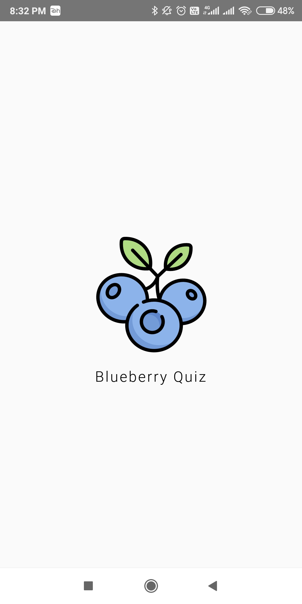

# Android Blueberry Quiz App

> A basic android project built with **Kotlin**. *Work in progress*.

  

# Features

* Implemented with Kotlin
* SplashScreen 
* Custom Font
* Material Design Components
* Icon in a Button
* viewModel for UI Data(updated dependencies)
